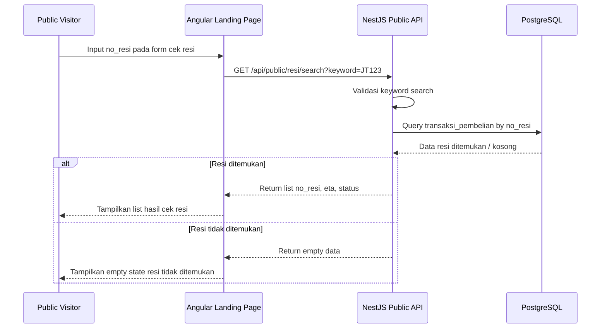
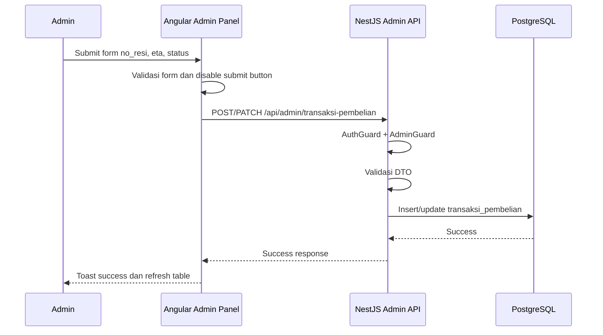
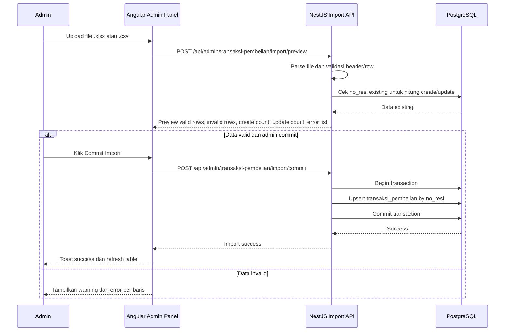
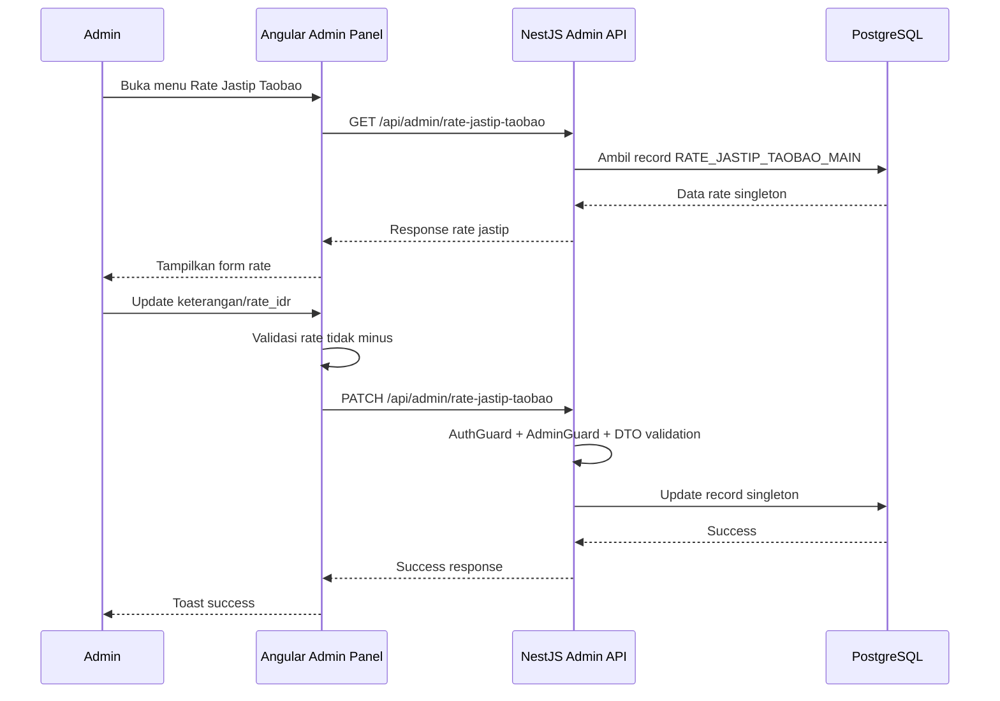
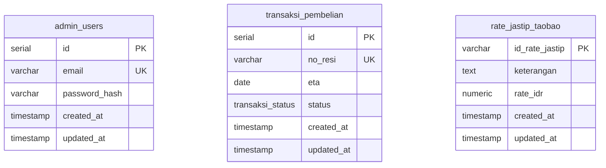

# PRD JEESTIP.ID - Scope Kecil Final

> Dokumen ini dibuat berdasarkan struktur PRD sebelumnya, tetapi scope sudah diperkecil menjadi **landing page + cek resi + admin transaksi pembelian + rate jastip Taobao + import Excel/CSV transaksi pembelian**.

---

## 1. Overview

### 1.1 Identitas Produk

| Item | Keterangan |
|---|---|
| Nama Produk | JEESTIP.ID |
| Jenis Produk | Website landing page jasa jastip China/Taobao dengan fitur cek resi barang dan admin panel sederhana |
| Scope Versi | MVP kecil / versi awal operasional |
| Target Pengguna | Public visitor dan admin operasional JEESTIP.ID |
| Dokumen untuk | Implementasi oleh AI Codex / developer |

### 1.2 Ringkasan Produk

JEESTIP.ID adalah website jasa titip barang dari China/Taobao ke Indonesia. Pada versi scope kecil ini, website tidak menggunakan customer portal, invoice, fee, topup Alipay/Wepay, atau transfer bank China.

Website hanya terdiri dari dua area utama:

1. **Landing Page Publik**  
   Menampilkan informasi layanan JEESTIP.ID, rate jastip Taobao, dan fitur cek/search resi barang.

2. **Admin Panel Sederhana**  
   Digunakan admin untuk mengelola data transaksi pembelian berupa `no_resi`, `eta`, dan `status`, serta mengelola rate jastip Taobao. Admin juga dapat melakukan import data transaksi pembelian menggunakan Excel `.xlsx` dan CSV `.csv`.

### 1.3 Tujuan Produk

- Menampilkan informasi layanan jastip China/Taobao secara jelas kepada public visitor.
- Memudahkan pengguna mengecek status barang menggunakan nomor resi tanpa perlu login.
- Memudahkan admin menginput, mengedit, mencari, dan mengimport data resi barang.
- Menampilkan rate jastip Taobao yang dapat diperbarui dari admin panel.
- Menjaga scope tetap sederhana agar development cepat, ringan, dan mudah di-maintain.

### 1.4 Role dan Hak Akses

| Role | Akses |
|---|---|
| Public Visitor | Melihat landing page, melihat rate jastip Taobao, dan mencari data resi barang. |
| Admin | Login ke admin panel, mengelola transaksi pembelian, import Excel/CSV transaksi pembelian, dan update rate jastip Taobao. |

---

## 2. Requirements

### 2.1 Functional Requirements

#### Landing Page Public

- Website memiliki landing page utama.
- Landing page menggunakan navbar horizontal di bagian atas.
- Landing page menampilkan informasi layanan jastip China/Taobao.
- Landing page menampilkan rate jastip Taobao dari database.
- Landing page memiliki fitur cek/search resi barang.
- Public visitor dapat memasukkan nomor resi pada form cek resi.
- Hasil search resi tampil dalam bentuk list.
- Setiap item hasil pencarian resi hanya menampilkan:
  - `no_resi`
  - `eta`
  - `status`
- Jika resi tidak ditemukan, tampilkan empty state.
- Jika API error, tampilkan error state yang aman untuk user.

#### Admin Panel

- Admin dapat login menggunakan email dan password.
- Admin panel menggunakan sidebar/navbar samping.
- Admin hanya memiliki dua menu utama:
  1. **Transaksi Pembelian**
  2. **Rate Jastip Taobao**
- Admin dapat logout dari admin panel.
- Admin endpoint wajib dilindungi authentication dan AdminGuard.

#### Menu Transaksi Pembelian

- Admin dapat melihat list transaksi pembelian.
- Admin dapat membuat data transaksi pembelian.
- Admin dapat mengedit data transaksi pembelian.
- Admin dapat mencari data berdasarkan nomor resi.
- Admin dapat memfilter data berdasarkan status.
- Admin dapat menggunakan pagination.
- Default list admin adalah 20 data per halaman.
- Limit maksimal adalah 100 data per request.
- Admin dapat melakukan import data transaksi pembelian melalui file Excel `.xlsx`.
- Admin dapat melakukan import data transaksi pembelian melalui file CSV `.csv`.
- Admin dapat preview hasil import sebelum data disimpan ke database.
- Admin dapat melihat error import per baris.
- Admin dapat commit import jika data valid.
- Hard delete tidak dibuat untuk versi ini.
- Soft delete tidak dibuat untuk versi ini.
- Jangan membuat cancel/disable flow tambahan.

Field transaksi pembelian:

| Field | Tipe | Required | Keterangan |
|---|---|---:|---|
| `id` | serial / uuid | Ya | ID internal database. Tidak perlu tampil ke public. |
| `no_resi` | varchar | Ya | Nomor resi barang. Wajib unique dan tidak boleh kosong. |
| `eta` | date | Ya | Estimation time / estimasi tiba. Format `YYYY-MM-DD`. |
| `status` | enum | Ya | `refund`, `close`, `sortir`, `on_process`, `on_ship`. |
| `created_at` | timestamp | Ya | Waktu data dibuat. |
| `updated_at` | timestamp | Ya | Waktu data terakhir diupdate. |

Catatan status:

| Value Database | Label UI |
|---|---|
| `refund` | Refund |
| `close` | Close |
| `sortir` | Sortir |
| `on_process` | On Process |
| `on_ship` | On Ship |

#### Menu Rate Jastip Taobao

- Menu Rate Jastip Taobao berbentuk single-setting form.
- Database hanya menyimpan 1 data rate jastip Taobao utama.
- Admin hanya dapat melihat dan mengupdate data rate.
- Admin tidak dapat create banyak data rate.
- Admin tidak dapat delete data rate.
- Landing page selalu membaca data rate dari record singleton tersebut.

Field rate jastip Taobao:

| Field | Tipe | Required | Keterangan |
|---|---|---:|---|
| `id_rate_jastip` | varchar | Ya | ID singleton, contoh `RATE_JASTIP_TAOBAO_MAIN`. |
| `keterangan` | varchar/text | Tidak | Keterangan rate yang tampil di landing page. |
| `rate_idr` | numeric(18,2) | Ya | Harga 1 Yuan RMB China dalam Rupiah. Tidak boleh minus dan disarankan lebih besar dari 0. |
| `updated_at` | timestamp | Ya | Waktu update terakhir. |

### 2.2 Import Excel/CSV Requirements

Import hanya berlaku untuk table **transaksi pembelian**.

#### Format File Import

File yang diterima:

- `.xlsx`
- `.csv`

Header wajib:

| Column | Required | Tipe | Aturan |
|---|---|---|---|
| `no_resi` | Ya | text | Unique, tidak boleh kosong. |
| `eta` | Ya | date | Format `YYYY-MM-DD`. |
| `status` | Ya | enum | `refund`, `close`, `sortir`, `on_process`, `on_ship`. |

Contoh CSV:

```csv
no_resi,eta,status
JT123456789,2026-08-20,on_ship
JT987654321,2026-08-22,sortir
JT456789123,2026-08-25,on_process
```

#### Aturan Import

- Row pertama wajib header.
- Nama header harus sama persis dengan template.
- File Excel/CSV tidak boleh langsung masuk database sebelum preview validasi.
- Maksimal ukuran file awal direkomendasikan 5 MB.
- Maksimal jumlah row per import awal direkomendasikan 5.000 row.
- `no_resi` wajib unique di database.
- Jika `no_resi` sudah ada di database, sistem melakukan update `eta` dan `status`.
- Jika `no_resi` belum ada di database, sistem membuat data baru.
- Jika ada duplikat `no_resi` dalam file yang sama, sistem menampilkan error sebelum commit.
- `eta` wajib format `YYYY-MM-DD`.
- `status` hanya boleh salah satu dari enum yang ditentukan.
- Commit import wajib menggunakan database transaction.
- Jika terjadi error fatal saat commit, sistem rollback perubahan.

#### Mode Import

Gunakan mode **upsert by no_resi**:

| Kondisi | Aksi |
|---|---|
| `no_resi` belum ada di database | Create data baru. |
| `no_resi` sudah ada di database | Update `eta` dan `status`. |
| Data invalid | Tampilkan error per baris dan jangan commit data invalid. |

#### Preview Import

Preview import harus menampilkan:

| Field | Keterangan |
|---|---|
| Total rows | Jumlah baris data. |
| Valid rows | Jumlah baris valid. |
| Invalid rows | Jumlah baris error. |
| Create count | Jumlah data baru yang akan dibuat. |
| Update count | Jumlah data existing yang akan diupdate. |
| Error list | Daftar error per baris. |

Contoh error per baris:

| Row | Column | Error |
|---:|---|---|
| 5 | `eta` | Format tanggal harus `YYYY-MM-DD`. |
| 8 | `status` | Status harus salah satu dari `refund`, `close`, `sortir`, `on_process`, `on_ship`. |
| 11 | `no_resi` | Nomor resi duplikat dalam file import. |

### 2.3 Non-Functional Requirements

- Website responsive untuk desktop, tablet, dan mobile.
- Landing page ringan dan cepat diakses.
- Search resi harus menggunakan query database yang aman dan tervalidasi.
- Public API search resi tidak boleh menampilkan data internal selain `no_resi`, `eta`, dan `status`.
- Admin endpoint wajib dilindungi authentication dan AdminGuard.
- Gunakan validasi backend untuk semua request.
- Gunakan notification handler untuk success, warning, dan error.
- Gunakan HTTPS pada production.
- Database PostgreSQL tidak boleh expose public port.
- Gunakan environment variable untuk konfigurasi production.
- Gunakan backup database berkala.

### 2.4 Out of Scope

Fitur berikut tidak termasuk pada versi ini:

- Customer login.
- Customer portal.
- Invoice.
- Fee.
- Topup Alipay/Wepay.
- Transfer Bank China.
- Payment gateway.
- Tracking otomatis ekspedisi.
- WhatsApp notification.
- Import Excel untuk modul selain transaksi pembelian.
- Multi-role admin kompleks.
- Soft delete.
- Hard delete data operasional.
- Cancel/disable flow tambahan.
- Audit log kompleks.
- Dashboard chart/statistik kompleks.

### 2.5 Acceptance Criteria

#### Landing Page

- Landing page tampil di route `/`.
- Landing page menggunakan navbar horizontal di bagian atas.
- Landing page menampilkan informasi layanan jastip China/Taobao.
- Landing page menampilkan rate jastip Taobao dari database.
- Landing page memiliki form cek resi.
- User dapat search no resi tanpa login.
- Hasil search hanya menampilkan `no_resi`, `eta`, dan `status`.
- Empty state muncul jika data tidak ditemukan.

#### Admin Panel

- Admin dapat login menggunakan email dan password.
- Admin dapat logout.
- Admin panel menggunakan sidebar/navbar samping.
- Admin hanya melihat menu Transaksi Pembelian dan Rate Jastip Taobao.
- Admin dapat create dan update data transaksi pembelian.
- Admin dapat search, filter status, dan pagination transaksi pembelian.
- Admin dapat update rate jastip Taobao.
- Tidak ada fitur delete, soft delete, cancel, atau disable.

#### Import Excel/CSV

- Admin dapat download template Excel dan CSV.
- Admin dapat upload file `.xlsx` atau `.csv`.
- Sistem melakukan preview validasi sebelum commit.
- Sistem menampilkan error per baris.
- Sistem melakukan upsert berdasarkan `no_resi`.
- Sistem rollback jika commit gagal.

---

## 3. Core Features

### 3.1 Landing Page

Landing page memiliki struktur utama:

1. Navbar atas.
2. Hero section JEESTIP.ID.
3. Section layanan jastip China/Taobao.
4. Section rate jastip Taobao.
5. Section cek resi barang.
6. Section cara kerja singkat.
7. CTA/kontak.
8. Footer.

Navbar public:

| Menu | Aksi |
|---|---|
| Home | Scroll ke hero section. |
| Jastip Taobao | Scroll ke section layanan/rate. |
| Cek Resi | Scroll ke form cek resi. |
| Login Admin | Redirect ke `/login`. |

Catatan UI:

- Landing page mengikuti design direction yang sudah dibuat sebelumnya: clean, modern, responsive, dan ringan.
- Navbar landing page tetap top navbar, bukan sidebar.
- Mobile/tablet dapat memakai hamburger/dropdown dari atas.
- Tombol dan card boleh menggunakan micro interaction ringan selama tidak mengganggu performa.

### 3.2 Cek Resi Public

Public visitor dapat memasukkan nomor resi pada form cek resi.

Behavior:

- Jika resi ditemukan, tampilkan list hasil.
- Jika lebih dari satu data cocok, tampilkan seluruh hasil relevan.
- Jika tidak ditemukan, tampilkan empty state: `Resi tidak ditemukan.`
- Jika API error, tampilkan error state: `Cek resi belum bisa diproses. Silakan coba lagi.`

Tampilan list hasil resi:

| No Resi | ETA | Status |
|---|---|---|
| `JT123456789` | `2026-08-20` | `On Ship` |

### 3.3 Admin Login

- Admin login menggunakan email dan password.
- Password wajib disimpan dalam bentuk hash.
- Login gagal tidak boleh membocorkan apakah email ada atau tidak.
- Setelah login berhasil, admin diarahkan ke `/admin/transaksi-pembelian`.
- Jika login gagal karena credential salah, tampilkan warning.
- Jika login gagal karena API/backend error, tampilkan error.

### 3.4 Admin Transaksi Pembelian

Tabel admin menampilkan:

| Field | Keterangan |
|---|---|
| `no_resi` | Nomor resi barang. |
| `eta` | Estimasi tiba. |
| `status` | Status barang. |
| `updated_at` | Terakhir diperbarui. |

Fitur halaman:

- Search no resi.
- Filter status.
- Pagination.
- Create data.
- Edit data.
- Import Excel/CSV.
- Download template Excel/CSV.
- Preview import.
- Commit import.
- Error report import per baris.
- Toast notification success/warning/error.

### 3.5 Rate Jastip Taobao

Rate jastip Taobao digunakan untuk menampilkan informasi harga/rate pada landing page.

Business rule:

- Rate jastip adalah singleton.
- Hanya ada 1 record utama.
- Admin hanya dapat update.
- Tidak ada create/delete/list/pagination.
- `rate_idr` adalah harga 1 Yuan RMB China dalam Rupiah.
- `rate_idr` tidak boleh minus dan disarankan lebih besar dari 0.

### 3.6 Notification Handler

| Kondisi | Tipe | Contoh Pesan |
|---|---|---|
| Create/update/import berhasil | Success | `Data berhasil disimpan.` |
| Validasi gagal | Warning | `Data belum valid. Periksa kembali input.` |
| Import file salah | Warning | `Format file tidak sesuai template.` |
| Search resi tidak ditemukan | Empty state | `Resi tidak ditemukan.` |
| API/backend/database error | Error | `Terjadi masalah pada sistem. Silakan coba lagi.` |

---

## 4. User Flow

### 4.1 Flow Public Visitor Cek Resi

1. Visitor membuka website JEESTIP.ID.
2. Visitor melihat informasi landing page dan rate jastip Taobao.
3. Visitor masuk ke section cek resi.
4. Visitor memasukkan nomor resi.
5. Frontend mengirim request ke API public cek resi.
6. Backend mencari data resi di database.
7. Jika ditemukan, frontend menampilkan list `no_resi`, `eta`, dan `status`.
8. Jika tidak ditemukan, frontend menampilkan empty state.

### 4.2 Flow Admin Input Manual Resi

1. Admin membuka halaman login.
2. Admin login menggunakan email dan password.
3. Admin masuk ke menu Transaksi Pembelian.
4. Admin klik Create.
5. Admin mengisi `no_resi`, `eta`, dan `status`.
6. Frontend validasi form.
7. Backend validasi DTO.
8. Data disimpan ke database.
9. Frontend menampilkan toast success.

### 4.3 Flow Admin Edit Resi

1. Admin membuka menu Transaksi Pembelian.
2. Admin mencari atau memilih data resi.
3. Admin klik Edit.
4. Admin mengubah `eta` atau `status`.
5. Frontend validasi form dan disable submit saat request berjalan.
6. Backend validasi DTO dan update data.
7. Frontend menampilkan toast success.

### 4.4 Flow Admin Import Excel/CSV

1. Admin masuk ke menu Transaksi Pembelian.
2. Admin klik tombol Import.
3. Admin upload file `.xlsx` atau `.csv`.
4. Frontend mengirim file ke endpoint preview.
5. Backend membaca file dan validasi seluruh row.
6. Backend mengembalikan preview: valid rows, invalid rows, create count, update count, dan error list.
7. Jika data valid, admin klik Commit Import.
8. Backend melakukan upsert berdasarkan `no_resi` dalam database transaction.
9. Frontend menampilkan toast success jika import berhasil.
10. Jika ada error, frontend menampilkan warning/error dan detail error per baris.

### 4.5 Flow Admin Update Rate Jastip Taobao

1. Admin masuk ke menu Rate Jastip Taobao.
2. Admin melihat form rate jastip saat ini.
3. Admin mengubah keterangan atau rate.
4. Frontend validasi agar rate tidak minus.
5. Backend validasi ulang.
6. Backend update 1 record singleton.
7. Landing page menampilkan data rate terbaru.

---

## 5. Architecture

### 5.1 High-Level Architecture

```text
Public Visitor / Admin
        |
        v
Angular Frontend Web
- Landing Page
- Cek Resi Public
- Admin Panel
        |
        v
NestJS Backend API
- Public API
- Auth API
- Admin API
- Import API
        |
        v
PostgreSQL Database
- Admin users
- Transaksi pembelian
- Rate jastip Taobao
```

Prinsip arsitektur:

- Frontend Angular hanya mengakses data melalui backend API.
- Backend NestJS menjadi pusat validasi, authentication, authorization, import parser, dan error handling.
- PostgreSQL menjadi source of truth untuk data resi dan rate jastip Taobao.
- Public API hanya mengekspos data yang aman ditampilkan ke visitor.
- Admin API wajib dilindungi authentication dan AdminGuard.

### 5.2 Frontend Architecture

```text
frontend/
  src/app/
    core/
      guards/
      interceptors/
      services/
    shared/
      components/
      pipes/
      utils/
    features/
      landing/
      auth/
      admin/
        transaksi-pembelian/
        rate-jastip-taobao/
```

Komponen utama:

| Component | Fungsi |
|---|---|
| `PublicNavbarComponent` | Navbar landing page. |
| `LandingPageComponent` | Halaman utama public. |
| `CekResiComponent` | Form dan hasil search resi. |
| `LoginComponent` | Login admin. |
| `AdminLayoutComponent` | Layout admin dengan sidebar. |
| `TransaksiPembelianPage` | List/create/edit/import transaksi pembelian. |
| `RateJastipTaobaoPage` | Form update rate jastip Taobao. |
| `DataTableComponent` | Tabel reusable. |
| `ImportDialogComponent` | Dialog upload dan preview import. |
| `ToastComponent` / `NotificationService` | Notification success/warning/error. |

Frontend routes:

```text
/
/login
/admin/transaksi-pembelian
/admin/rate-jastip-taobao
```

### 5.3 Backend Architecture

Backend NestJS terdiri dari module:

| Module | Fungsi |
|---|---|
| `AuthModule` | Login/logout admin. |
| `PublicModule` | API public landing page dan cek resi. |
| `TransaksiPembelianModule` | Admin create/read/update transaksi pembelian dan public search resi. |
| `ImportModule` | Preview dan commit import Excel/CSV transaksi pembelian. |
| `RateJastipTaobaoModule` | Read/update singleton rate jastip Taobao. |
| `AdminModule` | Guard dan API admin. |

### 5.4 API Design

#### Standard Success Response

```json
{
  "success": true,
  "message": "Data berhasil diproses.",
  "data": {},
  "meta": {}
}
```

#### Standard Error Response

```json
{
  "success": false,
  "error": {
    "code": "TRANSAKSI_IMPORT_VALIDATION_ERROR",
    "message": "File import belum valid.",
    "explanation": "Beberapa baris memiliki format tanggal atau status yang tidak sesuai.",
    "api": {
      "method": "POST",
      "endpoint": "/api/admin/transaksi-pembelian/import/preview",
      "http_status": 400,
      "module": "transaksi_pembelian",
      "action": "import_preview"
    },
    "details": [],
    "request_id": "req_xxxxx",
    "timestamp": "2026-08-14T19:56:00.000Z"
  }
}
```

#### Public API

| Method | Endpoint | Keterangan |
|---|---|---|
| GET | `/api/public/rate-jastip-taobao` | Ambil rate jastip Taobao singleton. |
| GET | `/api/public/resi/search?keyword=` | Search resi barang. |

#### Auth API

| Method | Endpoint | Keterangan |
|---|---|---|
| POST | `/api/auth/login` | Login admin. |
| POST | `/api/auth/logout` | Logout admin. |
| GET | `/api/auth/me` | Ambil session admin. |

#### Admin Transaksi Pembelian API

| Method | Endpoint | Keterangan |
|---|---|---|
| GET | `/api/admin/transaksi-pembelian` | List transaksi pembelian dengan pagination, search, dan filter status. |
| POST | `/api/admin/transaksi-pembelian` | Create transaksi pembelian. |
| PATCH | `/api/admin/transaksi-pembelian/:id` | Update transaksi pembelian. |
| POST | `/api/admin/transaksi-pembelian/import/preview` | Preview import Excel/CSV. |
| POST | `/api/admin/transaksi-pembelian/import/commit` | Commit import Excel/CSV. |
| GET | `/api/admin/transaksi-pembelian/import/template.xlsx` | Download template Excel. |
| GET | `/api/admin/transaksi-pembelian/import/template.csv` | Download template CSV. |

#### Admin Rate Jastip Taobao API

| Method | Endpoint | Keterangan |
|---|---|---|
| GET | `/api/admin/rate-jastip-taobao` | Ambil singleton rate jastip Taobao. |
| PATCH | `/api/admin/rate-jastip-taobao` | Update singleton rate jastip Taobao. |

---

## 6. Sequence Diagram

### 6.1 Public Visitor Cek Resi



### 6.2 Admin Input / Update Transaksi Pembelian



### 6.3 Admin Import Excel/CSV Transaksi Pembelian



### 6.4 Admin Update Rate Jastip Taobao



---

## 7. Database Schema

### 7.1 Enum

```sql
CREATE TYPE transaksi_status AS ENUM ('refund', 'close', 'sortir', 'on_process', 'on_ship');
```

Jika tidak menggunakan PostgreSQL enum, gunakan `varchar` dengan validasi backend.

### 7.2 Table: admin_users

| Column | Type | Constraint | Keterangan |
|---|---|---|---|
| `id` | serial | PK | ID admin. |
| `email` | varchar | unique, not null | Email admin. |
| `password_hash` | varchar | not null | Password yang sudah di-hash. |
| `created_at` | timestamp | default now | Waktu dibuat. |
| `updated_at` | timestamp | default now | Waktu update. |

Catatan:

- Password tidak boleh disimpan plain text.
- Untuk versi kecil, cukup admin login sederhana.
- Google login, 2FA, dan forgot password advanced dapat ditambahkan di fase berikutnya jika diperlukan.

### 7.3 Table: transaksi_pembelian

| Column | Type | Constraint | Keterangan |
|---|---|---|---|
| `id` | serial / uuid | PK | ID internal. |
| `no_resi` | varchar | unique, not null | Nomor resi barang. |
| `eta` | date | not null | Estimasi tiba. |
| `status` | transaksi_status | not null | Status barang. |
| `created_at` | timestamp | default now | Waktu dibuat. |
| `updated_at` | timestamp | default now | Waktu update. |

Recommended index:

```sql
CREATE UNIQUE INDEX idx_transaksi_pembelian_no_resi
ON transaksi_pembelian (no_resi);

CREATE INDEX idx_transaksi_pembelian_status
ON transaksi_pembelian (status);
```

Catatan index:

- Index `no_resi` wajib karena dipakai untuk search public dan upsert import.
- Index `status` boleh dibuat untuk filter admin.
- Jangan membuat terlalu banyak index pada versi awal agar overhead insert/update/import tetap ringan.

### 7.4 Table: rate_jastip_taobao

| Column | Type | Constraint | Keterangan |
|---|---|---|---|
| `id_rate_jastip` | varchar | PK, fixed singleton ID | Contoh nilai: `RATE_JASTIP_TAOBAO_MAIN`. |
| `keterangan` | text | nullable | Keterangan rate. |
| `rate_idr` | numeric(18,2) | not null, check > 0 | Harga 1 Yuan RMB China dalam Rupiah. |
| `created_at` | timestamp | default now | Waktu record dibuat melalui seed/migration. |
| `updated_at` | timestamp | default now | Waktu update. |

Constraint singleton:

```sql
ALTER TABLE rate_jastip_taobao
ADD CONSTRAINT rate_jastip_taobao_singleton_check
CHECK (id_rate_jastip = 'RATE_JASTIP_TAOBAO_MAIN');
```

### 7.5 ERD Mermaid



---

## 8. Tech Stack (Frontend, Backend API, Database, dan Deployment)

### 8.1 Frontend

| Komponen | Teknologi |
|---|---|
| Framework | Angular |
| Styling | Tailwind CSS |
| UI Component | spartan/ui |
| Routing | Angular Router |
| API Client | Angular HttpClient |
| Layout Public | Top navbar horizontal |
| Layout Admin | Sidebar/navbar samping |
| UI Helper | Toast/Notification, LoadingButton, DataTable, ImportDialog |

Catatan:

- shadcn tidak digunakan untuk versi saat ini.
- Jangan mengubah frontend menjadi React/Next.js.

### 8.2 Backend API

| Komponen | Teknologi |
|---|---|
| Framework | NestJS |
| ORM | Drizzle ORM |
| Authentication | Better Auth atau auth admin sederhana berbasis session/JWT sesuai keputusan teknis |
| File Upload | Multer atau file upload parser setara |
| Excel Parser | XLSX parser |
| CSV Parser | CSV parser |
| Validation | DTO ValidationPipe |
| Security | Helmet, CORS whitelist, rate limit endpoint login/import, input validation |
| Error Handling | Standard error response dengan code, message, explanation, api, request_id, timestamp |

### 8.3 Database

| Komponen | Teknologi |
|---|---|
| Database | PostgreSQL |
| Migration | Drizzle migration |
| Naming | snake_case |
| Currency | numeric/decimal, bukan float |
| Main Data | `transaksi_pembelian`, `rate_jastip_taobao`, `admin_users` |
| Data Safety | Tidak ada hard delete dan tidak ada soft delete untuk versi ini |

### 8.4 Deployment

| Komponen | Teknologi |
|---|---|
| Hosting | VPS |
| Container | Docker dan Docker Compose |
| Reverse Proxy | Nginx atau Traefik |
| SSL | Let’s Encrypt / HTTPS |
| Database Backup | Backup PostgreSQL berkala |
| Production Config | `.env` production, CORS domain, rate limit, migration, seed admin pertama |

Rekomendasi VPS awal:

| Kebutuhan | Rekomendasi |
|---|---|
| Traffic awal | ±100 pengguna/pengunjung per hari |
| Estimasi data | ±5 GB |
| VPS minimum | 1-2 vCPU, 1-2 GB RAM, 30 GB SSD |
| VPS rekomendasi | 2 vCPU, 2 GB RAM, 40 GB SSD |

### 8.5 Dokumentasi yang Harus Dibuat Developer

Developer/Codex harus menghasilkan dokumentasi berikut:

1. `README.md`
   - Cara install.
   - Cara menjalankan frontend/backend.
   - Cara setup environment.
   - Cara migration database.
   - Cara seed admin pertama.

2. `DATABASE.md`
   - Table schema.
   - Enum.
   - Index.
   - ERD.

3. `API.md`
   - List endpoint.
   - Request payload.
   - Response payload.
   - Error response.
   - Auth requirement.

4. `IMPORT_EXCEL_CSV.md`
   - Format template Excel/CSV transaksi pembelian.
   - Aturan column.
   - Contoh file.
   - Error handling.

5. `DEPLOYMENT.md`
   - Setup VPS.
   - Docker Compose.
   - Reverse proxy.
   - SSL.
   - Backup database.

---

## 9. Prompt Implementasi untuk Codex

```text
Bangun aplikasi website JEESTIP.ID berdasarkan PRD scope kecil ini.

Stack:
- Frontend: Angular, Tailwind CSS, spartan/ui
- Backend: NestJS, Drizzle ORM, Better Auth atau auth admin sederhana sesuai keputusan teknis
- Database: PostgreSQL
- Hosting target: VPS dengan Docker

Scope utama:
1. Buat landing page public JEESTIP.ID.
2. Buat fitur cek/search resi public tanpa login.
3. Hasil search resi hanya menampilkan no_resi, eta, dan status.
4. Buat admin login.
5. Buat admin panel dengan sidebar dan hanya 2 menu: Transaksi Pembelian dan Rate Jastip Taobao.
6. Menu Transaksi Pembelian hanya memiliki data no_resi, eta, dan status.
7. Status transaksi hanya: refund, close, sortir, on_process, on_ship.
8. Buat create/update/list/search/filter/pagination untuk Transaksi Pembelian.
9. Tambahkan import Excel .xlsx dan CSV .csv khusus untuk Transaksi Pembelian.
10. Import harus memiliki preview, validasi header, validasi row, error per baris, dan commit dengan mode upsert by no_resi.
11. Buat menu Rate Jastip Taobao sebagai single-setting form. Database hanya menyimpan 1 record singleton dan admin hanya bisa update.
12. Jangan buat customer login, customer portal, invoice, fee, topup Alipay/Wepay, transfer bank China, payment gateway, WhatsApp notification, tracking otomatis, soft delete, hard delete, cancel, atau disable flow.
13. Gunakan notification success/warning/error.
14. Gunakan validasi backend dan frontend.
15. Deploy ke VPS menggunakan Docker, reverse proxy, SSL, dan PostgreSQL.

Ikuti database schema, API design, sequence diagram, dan acceptance criteria pada PRD ini.
```
